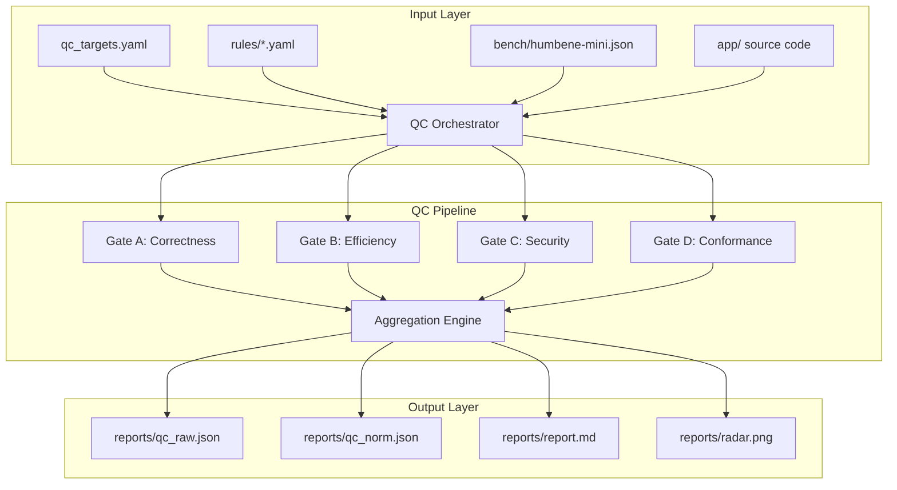

# Design Document

## Overview

The SPI-QC Mini system implements a modular, pipeline-based architecture for measuring code quality across four dimensions: Correctness, Efficiency, Security, and Conformance. The design emphasizes deterministic execution, clear separation of concerns, and extensibility while maintaining simplicity for educational and research use.

The system operates as a measurement framework that evaluates a sample Flask CRUD application and function benchmarks, producing normalized quality scores through a harmonic mean aggregation approach that penalizes weak performance in any dimension.

## Architecture

### High-Level Architecture



### Component Architecture

The system follows a modular adapter pattern where each gate is implemented as an independent script that can be executed standalone or orchestrated by the main runner:

- **QC Orchestrator** (`qc/run_qc.py`): Main entry point that coordinates gate execution
- **Gate Adapters** (`qc/run_*.py`): Independent measurement modules for each quality dimension
- **Utility Layer** (`qc/utils.py`): Shared normalization, aggregation, and reporting functions
- **Rule Engines** (`scripts/*.py`): Configurable checkers for conformance validation
- **Sample Application** (`app/`): Flask CRUD service that serves as the evaluation target

## Components and Interfaces

### 1. QC Orchestrator (`qc/run_qc.py`)

**Purpose**: Main entry point that coordinates gate execution, aggregation, and reporting.

**Interface**:
```python
def main(
    targets_file: str = "qc_targets.yaml",
    solutions_dir: str = "bench/canonical_solutions.py", 
    attempt_repair: bool = False,
    report_md: str = "reports/report.md",
    radar_png: str = "reports/radar.png",
    raw_json: str = "reports/qc_raw.json",
    norm_json: str = "reports/qc_norm.json"
) -> int  # exit code
```

**Responsibilities**:
- Parse CLI arguments and configuration
- Execute gate adapters in sequence
- Collect and aggregate raw metrics
- Generate normalized scores and final Qc value
- Produce all output artifacts
- Handle errors and logging

### 2. Gate A: Correctness (`qc/run_build.py`)

**Purpose**: Measure code correctness through function benchmarks and build/test success.

**Interface**:
```python
def measure_correctness() -> Dict[str, float]:
    return {
        "exec_pass": float,    # [0,1] function benchmark pass rate
        "compile": float,      # [0,1] pytest pass rate  
        "repo_exec": float     # [0,1] smoke test success
    }
```

**Dependencies**:
- `bench/run_funcs.py`: Execute function benchmarks
- `bench/grade_funcs.py`: Grade benchmark results
- `pytest`: Run unit and smoke tests

### 3. Gate B: Efficiency (`qc/run_perf.py`)

**Purpose**: Measure execution efficiency in terms of latency, memory, and throughput.

**Interface**:
```python
def measure_efficiency() -> Dict[str, float]:
    return {
        "lat_ms_avg": float,   # Average latency in milliseconds
        "thr_ops": float,      # Throughput in operations/second
        "mem_mb_avg": float    # Average memory usage in MB
    }
```

**Implementation Strategy**:
- Use `/usr/bin/time -v` or Python `resource` module for accurate measurements
- Measure only successful function tasks to avoid skewing results
- Batch execution for throughput calculation
- Average metrics across all successful tasks

### 4. Gate C: Security (`qc/run_sec.py`)

**Purpose**: Detect security vulnerabilities and assess dependency health.

**Interface**:
```python
def measure_security() -> Dict[str, float]:
    return {
        "S_detect": float,     # [0,1] vulnerability detection rate
        "S_repair": float,     # [0,1] automated repair success (v1: 0.0)
        "S_deps": float        # [0,1] dependency health ratio
    }
```

**Tool Integration**:
- `bandit -q -r app/src -f json -o reports/bandit.json`
- `pip-audit -r app/requirements.txt -f json -o reports/deps_audit.json`
- Planted vulnerabilities in `app/src/insecure_examples.py` for detection validation

### 5. Gate D: Conformance (`qc/run_conf.py`)

**Purpose**: Validate adherence to coding standards, framework idioms, and architecture patterns.

**Interface**:
```python
def measure_conformance() -> Dict[str, float]:
    return {
        "C_lint": float,       # [0,1] linting tool pass rate
        "C_idiom": float,      # [0,1] framework idiom compliance
        "C_arch": float        # [0,1] architecture pattern compliance
    }
```

**Rule Engine Integration**:
- `scripts/idiom_checks.py rules/flask_idioms.yaml`
- `scripts/arch_checks.py rules/microservice.yaml`
- `flake8` and `black --check` for code style

### 6. Aggregation Engine (`qc/utils.py`)

**Purpose**: Normalize metrics, apply weights, and compute final quality scores.

**Key Functions**:
```python
def normalize_metrics(raw_metrics: Dict, targets: Dict) -> Dict[str, float]
def harmonic_mean(values: List[float], weights: List[float], epsilon: float = 1e-6) -> float
def compute_quality_scores(norm_metrics: Dict, weights: Dict) -> Dict[str, float]
def generate_radar_chart(scores: Dict, output_path: str) -> None
```

**Aggregation Formula**:
```
Q_gate = (Σ(weight_i / (metric_i + ε)))^(-1)
Qc = (Σ(α_gate / (Q_gate + ε)))^(-1)
```

### 7. Sample Application (`app/`)

**Purpose**: Provide a realistic Flask CRUD service for quality measurement.

**API Endpoints**:
- `POST /todos` - Create todo item
- `GET /todos` - List all todos  
- `GET /todos/{id}` - Get specific todo
- `PUT /todos/{id}` - Update todo
- `DELETE /todos/{id}` - Delete todo
- `GET /healthz` - Health check

**Engineering Patterns**:
- Structured logging with request IDs (`logging_conf.py`)
- Simple in-memory caching (`cache.py`)
- Rate limiting middleware (`rate_limit.py`)
- OpenAPI 3.0 specification (`openapi.yaml`)

## Data Models

### Configuration Model (`qc_targets.yaml`)

```yaml
weights:
  alpha:           # Gate weights for final Qc
    Corr: 0.4
    Eff: 0.2
    Sec: 0.2
    Conf: 0.2
  beta: [0.5, 0.3, 0.2]    # Correctness submetrics
  gamma: [0.5, 0.2, 0.3]   # Efficiency submetrics  
  delta: [0.6, 0.2, 0.2]   # Security submetrics
  zeta: [0.5, 0.3, 0.2]    # Conformance submetrics

targets:
  latency_ms: 50
  throughput_qps: 100
  mem_mb: 128

bands:
  industrial_ready: 0.80
  prototype: 0.65

epsilon: 1e-6
```

### Raw Metrics Model (`reports/qc_raw.json`)

```json
{
  "meta": {
    "timestamp_utc": "ISO-8601",
    "git": {"commit": "string", "dirty": boolean},
    "env": {"python": "string", "platform": "string", "cpus": int, "mem_gb": int}
  },
  "gate_A": {
    "exec_pass": float,
    "compile": float, 
    "repo_exec": float,
    "details": {"passed": int, "total": int, "pytest_pass": int, "pytest_total": int}
  },
  "gate_B": {
    "lat_ms_avg": float,
    "thr_ops": float,
    "mem_mb_avg": float,
    "details": {"n_tasks": int}
  },
  "gate_C": {
    "S_detect": float,
    "S_repair": float,
    "S_deps": float,
    "details": {"bandit_findings": int, "planted": int, "deps_ok": int, "deps_total": int}
  },
  "gate_D": {
    "C_lint": float,
    "C_idiom": float,
    "C_arch": float,
    "details": {"flake8": int, "black_check": int, "idiom_pass": int, "idiom_total": int}
  }
}
```

### Normalized Results Model (`reports/qc_norm.json`)

```json
{
  "norm": {
    "E_lat": float,
    "E_thr": float, 
    "E_mem": float
  },
  "Q_sub": {
    "Q_Corr": float,
    "Q_Eff": float,
    "Q_Sec": float,
    "Q_Conf": float
  },
  "Qc": float,
  "bands": {"industrial_ready": float, "prototype": float},
  "weights": {...},
  "targets": {...},
  "epsilon": float
}
```

### Todo Item Model (`app/src/models.py`)

```python
@dataclass
class TodoItem:
    id: int
    title: str
    done: bool = False
    created_at: datetime = field(default_factory=datetime.utcnow)
    updated_at: datetime = field(default_factory=datetime.utcnow)
```

## Error Handling

### Error Categories

1. **Configuration Errors**: Invalid YAML, missing files, malformed targets
2. **Execution Errors**: Tool failures, timeouts, resource exhaustion  
3. **Data Errors**: Invalid JSON, missing metrics, computation failures
4. **System Errors**: Permission issues, disk space, network problems

### Error Handling Strategy

**Graceful Degradation**: The system continues execution even when individual components fail, setting failed metrics to 0.0 and logging errors.

**Error Propagation**: 
- Gate-level failures set all gate metrics to 0.0
- Tool-level failures set specific metrics to 0.0
- System-level failures cause pipeline abort with non-zero exit code

**Logging Strategy**:
- All errors logged to `reports/qc_run.log` with timestamps
- Error details included in raw JSON output
- Report includes error summary section

**Timeout Handling**:
- Function tasks: 2s timeout (configurable)
- Smoke tests: 5s timeout (configurable)  
- Gate execution: 30s timeout per gate
- Overall pipeline: 5min timeout

## Testing Strategy

### Unit Testing

**Scope**: Individual components and utility functions
**Location**: `app/tests/unit/`
**Coverage**: Models, utilities, core business logic

**Key Test Cases**:
- Todo CRUD operations
- Metric normalization functions
- Harmonic mean calculations
- Configuration parsing
- Error handling paths

### Integration Testing  

**Scope**: End-to-end workflows and component interactions
**Location**: `app/tests/smoke/`
**Coverage**: API endpoints, gate execution, pipeline orchestration

**Key Test Cases**:
- Complete CRUD round-trip (`test_crud_roundtrip.py`)
- Gate execution with mocked dependencies
- Configuration loading and validation
- Report generation pipeline

### Benchmark Testing

**Scope**: Function-level correctness validation
**Location**: `bench/`
**Coverage**: 10 algorithmic problems with canonical solutions

**Test Execution**:
- Import canonical solutions dynamically
- Execute against JSON test cases
- Compare outputs for exact matches
- Compute pass/fail ratios

### Performance Testing

**Scope**: Efficiency measurement validation
**Strategy**: Self-measurement during normal execution
**Metrics**: Latency, memory usage, throughput under normal load

### Security Testing

**Scope**: Vulnerability detection validation  
**Strategy**: Planted vulnerabilities with known detection signatures
**Tools**: Bandit SAST, pip-audit dependency scanning

### Conformance Testing

**Scope**: Code style and architecture pattern validation
**Tools**: flake8, black, custom rule engines
**Coverage**: Style compliance, framework idioms, architecture patterns

## Implementation Notes

### Determinism Requirements

- Set `PYTHONHASHSEED=0` in all execution environments
- Use explicit random seeds for any stochastic operations
- Pin all dependency versions in `requirements.txt`
- Avoid system-dependent operations where possible

### Resource Management

- Implement timeouts for all external tool executions
- Monitor memory usage during efficiency measurements
- Clean up temporary files and processes
- Respect CPU and memory limits in containerized environments

### Extensibility Design

- Gate adapters are independent and can be executed standalone
- Rule files are YAML-based and easily customizable
- Target values and weights are externally configurable
- Additional languages can be supported by adding new gate adapters

### Performance Considerations

- Minimize I/O operations during measurements
- Cache expensive computations where appropriate
- Use efficient data structures for metric aggregation
- Optimize report generation for large datasets

## Traceability Matrix

| Requirement | Primary Components | Implementation Notes |
|-------------|-------------------|---------------------|
| Req 1: Project Structure | `Makefile`, directory scaffold | Exact structure enforced by scaffolding scripts |
| Req 2: Flask CRUD App | `app/src/*.py`, `app/openapi.yaml` | In-memory storage, engineering patterns |
| Req 3: Test Suite | `app/tests/unit/*`, `app/tests/smoke/*` | Unit + integration coverage |
| Req 4: Gate A Correctness | `bench/*`, `qc/run_build.py` | Function benchmarks + build metrics |
| Req 5: Gate B Efficiency | `qc/run_perf.py`, measurement utilities | Resource monitoring during execution |
| Req 6: Gate C Security | `qc/run_sec.py`, `app/src/insecure_examples.py` | SAST + dependency scanning |
| Req 7: Gate D Conformance | `qc/run_conf.py`, `scripts/*.py`, `rules/*.yaml` | Linting + custom rule engines |
| Req 8: Aggregation | `qc/run_qc.py`, `qc/utils.py` | Harmonic mean with configurable weights |
| Req 9: Build System | `container/*`, `Makefile` | Docker + make targets |
| Req 10: Documentation | `README.md` | Usage examples and oracle explanations |
| Req 11: Non-Functional | All components | Determinism, timeouts, resource limits |
| Req 12: CLI Interface | `qc/run_qc.py` argument parsing | Configurable execution parameters |
| Req 13: Output Formats | JSON schema validation, precision rules | Structured data interchange |
| Req 14: Report Layout | `reports/report.md` generation | Human-readable quality insights |
| Req 15: Error Handling | Error propagation, logging, degradation | Robust failure modes |

## Extensibility Design

### Language Runtime Extension

The gate adapter pattern supports additional language runtimes through a common interface:

```python
class GateAdapter:
    def measure_correctness(self, source_dir: str) -> Dict[str, float]:
        """Language-specific correctness measurement"""
        pass
    
    def get_build_command(self) -> List[str]:
        """Return build command for this language"""
        pass
    
    def get_test_command(self) -> List[str]:
        """Return test command for this language"""
        pass
```

**Extension Points**:
- `qc/run_build.py --language java` → use Maven/Gradle commands
- `qc/run_build.py --language node` → use npm/yarn commands  
- Language-specific rule files: `rules/spring_idioms.yaml`, `rules/express_idioms.yaml`
- Benchmark adaptations: `bench/java_solutions/`, `bench/node_solutions/`

### Security Isolation

**Sandbox Execution**: All code execution occurs within controlled environments:
- Docker containers with no network access during measurement
- Resource limits enforced: `--cpus="2" --memory="8g"`
- Temporary filesystem isolation for test execution
- Process monitoring to prevent resource exhaustion

**Planted Vulnerability Isolation**: 
- `app/src/insecure_examples.py` contains only static code patterns
- No actual execution of vulnerable code paths
- Import-only access for SAST scanning
- Clear separation from production code paths

### Visualization Extensibility

**Output Format Hooks**:
```python
def export_metrics(metrics: Dict, format: str, output_path: str):
    """Export metrics in various formats"""
    if format == "csv":
        export_csv(metrics, output_path)
    elif format == "html":
        export_html_dashboard(metrics, output_path)
    elif format == "json":
        export_json(metrics, output_path)
```

**Visualization Options**:
- Default: Matplotlib radar chart (`radar.png`)
- CSV export: `--export-csv reports/metrics.csv`
- HTML dashboard: `--export-html reports/dashboard.html`
- Integration with external tools: Grafana, Tableau, custom dashboards

### CI/CD Integration

**GitHub Actions Integration**:
```yaml
- name: Run QC Analysis
  run: |
    make install
    make qc
- name: Upload QC Artifacts
  uses: actions/upload-artifact@v3
  with:
    name: qc-reports
    path: reports/
```

**CI Integration Points**:
- Exit codes for pass/fail thresholds
- Artifact upload: `qc_raw.json`, `qc_norm.json`, `report.md`, `radar.png`
- Quality gate enforcement: fail CI if `Qc < threshold`
- Trend analysis: compare metrics across commits
- PR comments with quality summaries

**Enterprise Integration**:
- SonarQube plugin compatibility via JSON export
- Jenkins pipeline integration with quality gates
- Slack/Teams notifications with quality summaries
- Database storage for historical trend analysis

This design provides a solid foundation for implementing a robust, extensible, and maintainable code quality measurement system that meets all the specified requirements while remaining simple enough for educational and research use.