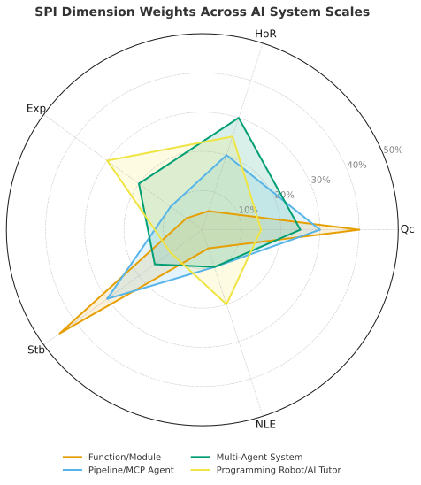

# Symbiotic Programming Index (SPI)

## Disclaimer & Positioning

This document is an **open, early-stage exploration** of the *Symbiotic Programming Index (SPI)*.  
It does **not** claim to be a final standard, but rather a **working draft** intended to spark discussion, invite critique, and evolve through community feedback.

- **Work-in-Progress**: The framework, metrics, and methodology described here are provisional and subject to revision.  
- **Community-Oriented**: The goal is to encourage collaboration across academia and industry, not to assert ownership or exclusivity.  
- **Limitations**: At this stage, validation experiments are preliminary. Reproducibility and peer-reviewed publication remain ongoing priorities.  
- **Next Steps**: Formal evaluation, dataset releases, and submissions to archival venues (e.g., ICSE, ASE, FSE, NeurIPS workshops) are planned to ensure academic rigor.

By sharing this draft publicly, we hope to **surface blind spots, refine methods, and build a shared foundation** for studying human–AI co-production in software engineering.  
Contributions, critiques, and replications are warmly welcome.

---

## 👉 Why SPI is Inevitable

The Symbiotic Programming Index (SPI) is not about inflating the value of a research idea. Its necessity comes from objective trends that the industry cannot avoid:

1. **Inevitable Competition of Claims**
   In five years, every vendor will say: *“My AI coding workflow is the best, my IDE is the best, my coding agent is the best.”*
   Without a reproducible yardstick, these claims will remain marketing noise. SPI exists to turn “best” into something measurable.

2. **Educational and Professional Demand**
   Future curricula cannot stop at teaching syntax or casual prompt tricks.
   Students will need to learn orchestration, reproducibility, and explainability as core competencies. SPI provides the metrics that define what “competence” means in an AI–human workflow.

3. **Governance and Trust in Critical Domains**
   In healthcare, aviation, or finance, no one will trust a workflow just because a vendor says so.
   Certification will be required — just like ISO standards today. SPI is positioned as the certification framework for AI coding workflows: quality (Qc), human-off ratio (HoR), explainability (Exp), and stability (Stb).


**In short:**
SPI is not optional. It is the measuring instrument that industry, education, and governance will all require once AI coding moves from experimentation to infrastructure.

---

## Applicability and Scalability of SPI

The Symbiotic Programming Index (SPI) is not a static benchmark.
Its value lies in scalability: different dimensions acquire different weights depending on the *scale and purpose* of the AI system being evaluated.

* At the **micro level** (functions, modules, MCP components), reproducibility and quality dominate.
* At the **workflow level** (pipelines, multi-agent orchestration), stability and human-off ratio become central.
* At the **macro level** (autonomous programming robots or AI tutors), explainability and natural language engagement take priority.

This adaptability highlights SPI as a *living framework* that can flexibly adjust to the maturity, size, and goals of AI–human coding systems.

| **AI System Scale**          | **Qc** | **HoR** | **Exp** | **Stb** | **NLE** | **Key Implication**                                         |
| ---------------------------- | ------ | ------- | ------- | ------- | ------- | ----------------------------------------------------------- |
| Function / Module            | 40%    | 5%      | 5%      | 45%     | 5%      | Industrial-grade testing and reproducibility are paramount. |
| Pipeline / MCP Agent         | 30%    | 20%     | 10%     | 30%     | 10%     | Balance stability and human–AI orchestration efficiency.    |
| Multi-Agent System           | 25%    | 30%     | 20%     | 15%     | 10%     | Human role shifts to orchestrator; HoR gains importance.    |
| Programming Robot / AI Tutor | 15%    | 25%     | 30%     | 10%     | 20%     | Explainability and multilingual fairness are essential.     |




---

## 🌍 Background & Motivation

Conventional benchmarks such as **CodeXGLUE**, **HumanEval**, and **MBPP** measure the *capabilities of models in isolation*.  
They ask: *Can a model generate correct solutions for given tasks?*

But this is no longer the central question.  
The real challenge is: **How do humans and AI co-produce software reliably, reproducibly, and pedagogically?**

- Traditional metrics ignore **workflow quality** (replay stability, orchestration cost, reproducibility).  
- They ignore **human-off ratio** (how far humans can “let go” without loss of accountability).  
- They ignore **AI explainability** (can AI articulate its reasoning as a tutor, not just a coder).  

**SPI** addresses these blind spots by shifting the unit of analysis:  
👉 from *models* to *workflows*.  
👉 from *outputs* to *orchestration*.  
👉 from *performance* to *symbiosis*.

---

## 🔬 Methodological Frame

SPI is operationalised through **five measurable dimensions**: Qc, HoR, Exp, Stb, and NLE.  

We study them across **controlled workflows**:

- **Human-only coding** — traditional baseline.  
- **AI-only generation** — single-shot, minimal orchestration.  
- **Human–AI orchestration** — cached prompts, validators, multi-agent flows.  

**Metrics & Validation:**

- *Qc* is defined across four dimensions:  

  - **Correctness**  
    Measured by unit/integration test pass rates and defect density.  

  - **Efficiency**  
    Measured by runtime benchmarks and resource utilisation profiles.  

  - **Security**  
    Measured by vulnerability scans and static analysis reports.  

  - **Conformance**  
    Measured by CI/CD pipeline success, linting compliance, and code review acceptance. 
- *HoR*: number of edits, prompt ratio, human LOC %.  
- *Exp*: reviewer-rated clarity, learning outcomes in student studies.  
- *Stb*: test–retest reproducibility, regression recurrence.  
- *NLE*: cross-lingual robustness, semantic drift under translation.  

Validation strategies include:  
- **Convergent validity** — SPI vs. defect density / productivity.  
- **Test–retest reliability** — same orchestration across model versions.  
- **Cross-model generalisation** — GPT, Claude, DeepSeek, Gemini.  

---

## 🎯 Contribution Highlights

- **Academic** — A reproducible taxonomy of orchestration workflows and failure modes.  
- **Industrial** — Criteria for hybrid QA pipelines, measuring when AI coders can be trusted.  
- **Educational** — Pedagogical modules where AI acts as tutor; orchestration as a core competency.  
- **Philosophical** — Embedding debates on authorship, agency, and epistemology into measurable indices.  

---


## 📊 Priority and Progression

The five SPI dimensions do not carry equal weight at all times.  
They form a **research staircase** — from practical foundations to higher-order challenges:

1. **Qc (Code Quality)** → the entry point. Without quality, nothing else matters.  
2. **HoR (Human-off Ratio)** → once quality is reliable, measure how far humans can step back.  
3. **Exp (Explainability)** → with reduced human intervention, demand that AI explains itself intelligibly.  
4. **Stb (Stability)** → the maturity test: workflows must remain reproducible across runs, contexts, and model versions.  
5. **NLE (Natural Language Engagement)** → the societal horizon: true symbiosis must work across languages and cultures.

**Grouping:**
- **Qc + Stb** → the **industrial foundation**, ensuring reliability and trustworthiness.  
- **HoR + Exp** → the **academic and philosophical breakthrough**, redefining the role of engineers and AI’s epistemic value.  
- **NLE** → the **societal horizon**, preventing an English-only bottleneck and enabling global inclusivity.  

This priority ordering also mirrors **analysis difficulty and depth**:  
from **Qc (low difficulty, mid depth)** → **HoR (moderate)** → **Exp (high)** → **Stb (very high)** → **NLE (extreme)**.  
The first three are “visible mountains,” while Stb and NLE remain “peaks in the clouds.”

---
## 📐 SPI Formula

$$
\text{SPI}=\; w_{Qc}\,Qc + w_{HoR}\,HoR + w_{Exp}\,Exp + w_{Stb}\,Stb + w_{NLE}\,NLE,
\quad \text{s.t. } \sum_i w_i = 1,\; w_i \ge 0
$$

Weights \(w_i\) adapt to context:

- Industry → emphasise \(Qc\) + \(Stb\) 

- Education → emphasise \(HoR\) + \(Exp\)  

- Global fairness → emphasise \(NLE\)

---

## 📚 Documentation Structure

- **Dimensions**
  - [Code Quality (Qc)](./qc/index.md)  
  - [Human-off Ratio (HoR)](./hor/index.md)  
  - [AI Explainability (Exp)](./exp/index.md)  
  - [Stability (Stb)](./stb/index.md)  
  - [Natural Language Engagement (NLE)](./nle/index.md)  

- **Licenses**
  - [License](./license.md) — sharing and citation rules

---

## 🚀 Enduring Aim

**Symbiotic Programming Index (SPI)** does not attempt to cover all dimensions of human–AI symbiosis.
Its scope is deliberately narrow: programming workflows.
By specialising in this domain, SPI provides the rigorous foundation upon which broader forms of symbiosis may later be studied.

SPI is not just about *faster coding*.  
It is about **redefining the act of programming itself**:  

- From authorship to orchestration.  
- From isolated benchmarks to reproducible indices.  
- From intuition to science.  

Our aim is to establish a **visible, teachable, and reproducible foundation** for software engineering in the AI era.  


## ✍️ Citation

If you use SPI ideas, metrics, or datasets, please cite as:

> **Charles Li and the SPI Project Contributors**,
> *Symbiotic Programming Index (SPI): Measuring Human–AI Co-Production in Software Engineering*, 2025.
> Available at: **[https://github.com/AIPaPaCha/symbiotic-programming-index](https://github.com/AIPaPaCha/symbiotic-programming-index)**

**BibTeX**

```bibtex
@misc{spi2025,
  author       = {Charles Li and SPI Project Contributors},
  title        = {Symbiotic Programming Index (SPI): Measuring Human--AI Co-Production in Software Engineering},
  year         = {2025},
  howpublished = {\url{https://github.com/AIPaPaCha/symbiotic-programming-index}},
  note         = {Version 0.1, Open Research Project}
}
```

---

## 📜 License

* **Code**: Apache-2.0 — see [`LICENSE`](./LICENSE)
* **Docs & research materials** (e.g., statements, methodology in `/docs`): **CC BY-NC 4.0** — see [`LICENSE-CC-BY-4.0`](./LICENSE-CC-BY-4.0)

This dual license lets **code be freely reused**, while keeping **research documents non-commercial**.

---

## 📬 Contact

For collaboration or inquiries:

* **Author**: Charles Li
* **Email**: [charles\_lmq@outlook.com](mailto:charles_lmq@outlook.com)

---
