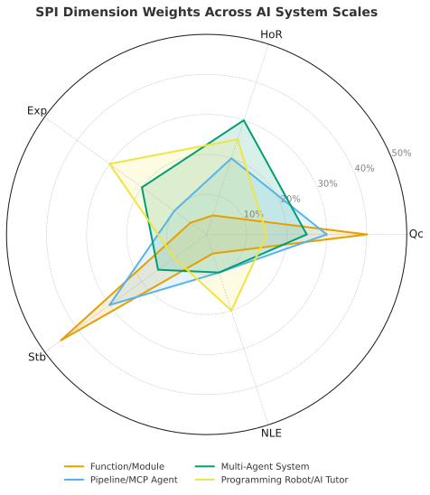

# Symbiotic Programming Index (SPI)

**A practical framework for measuring human–AI coding workflows.**

SPI gives you a structured way to evaluate how well humans and AI collaborate to produce software. It works for individual developers, engineering teams, and educators — and it is designed to be used directly with AI agents.

> **New to SPI?** Start with the [SPI Schema](https://github.com/AIPaPaCha/symbiotic-programming-index/blob/main/SPI_SCHEMA.md) — a single file you can hand to any AI agent to evaluate your workflow.

---

## What SPI Measures

SPI evaluates workflows (not models) across **five dimensions**:

| Dimension | Question | Status |
|-----------|----------|--------|
| [**Qc** — Code Quality](./qc/index.md) | Does the workflow produce software that works, performs well, is secure, and follows conventions? | Mature |
| [**HoR** — Human-off Ratio](./hor/index.md) | How far can the human step back while maintaining quality? | Outlined |
| [**Exp** — AI Explainability](./exp/index.md) | Can the AI explain its design choices for trust and learning? | Early |
| [**Stb** — Stability](./stb/index.md) | Are results reproducible across runs, sessions, and model versions? | Early |
| [**NLE** — Natural Language Engagement](./nle/index.md) | Does the workflow remain effective across languages and cultures? | Early |

These dimensions form a **staircase**: Qc is the foundation (nothing matters without quality), HoR is the leverage point (how much can humans let go), and Exp/Stb/NLE ascend toward trust, reproducibility, and global fairness.

---

## The SPI Formula

$$
\text{SPI}=\; w_{Qc}\,Qc + w_{HoR}\,HoR + w_{Exp}\,Exp + w_{Stb}\,Stb + w_{NLE}\,NLE,
\quad \text{s.t. } \sum_i w_i = 1,\; w_i \ge 0
$$

Weights adapt to your context:

| Profile | Qc | HoR | Exp | Stb | NLE | Use when... |
|---------|-----|------|------|------|------|-------------|
| **Industry** | 0.35 | 0.15 | 0.10 | 0.30 | 0.10 | Evaluating production code and CI/CD pipelines |
| **Education** | 0.20 | 0.25 | 0.30 | 0.10 | 0.15 | Teaching orchestration, assessing students |
| **Research** | 0.25 | 0.20 | 0.20 | 0.25 | 0.10 | Benchmarking and reproducibility studies |
| **Global/Equity** | 0.20 | 0.10 | 0.10 | 0.15 | 0.45 | Cross-lingual fairness audits |
| **Balanced** | 0.20 | 0.20 | 0.20 | 0.20 | 0.20 | General-purpose evaluation |

---

## How to Use SPI

### For Individual Developers

Hand the [SPI Schema](https://github.com/AIPaPaCha/symbiotic-programming-index/blob/main/SPI_SCHEMA.md) to your AI agent and ask it to evaluate a recent coding session. The agent will walk you through measuring each dimension and produce an SPI score with recommendations.

**Minimal workflow:**

1. Pick a task you completed with AI assistance
2. Run your tests → Correctness score
3. Run your linter + security scanner → Conformance + Security scores
4. Count your prompts and edits → HoR score
5. Compute SPI with your preferred weight profile

### For Teams and Organisations

Use SPI to benchmark AI-assisted workflows against baselines:

1. Define a representative task set (5–10 tasks of varying complexity)
2. Run each in three modes: human-only, AI-only, human–AI orchestrated
3. Score all five dimensions for each mode
4. The value of orchestration = SPI(orchestrated) - max(SPI(human-only), SPI(AI-only))
5. Set quality gates: Qc ≥ 0.8 for production, Qc ≥ 0.6 for staging

### For Educators and Researchers

Map SPI dimensions to learning objectives:

- "Students produce Qc ≥ 0.7 code using AI" → quality competency
- "Students achieve HoR ≥ 0.6 while maintaining Qc ≥ 0.7" → orchestration competency
- "Students can evaluate AI explanations for accuracy" → explainability literacy

Detailed protocols are in the [SPI Schema](https://github.com/AIPaPaCha/symbiotic-programming-index/blob/main/SPI_SCHEMA.md), Section 4.3.

---

## Scalability by AI System Type

The five dimensions acquire different weights depending on the **scale** of the AI system:

| AI System Scale | Qc | HoR | Exp | Stb | NLE | Key Focus |
|-----------------|-----|------|------|------|------|-----------|
| Function / Module | 0.40 | 0.05 | 0.05 | 0.45 | 0.05 | Testing and reproducibility |
| Pipeline / Agent | 0.30 | 0.20 | 0.10 | 0.30 | 0.10 | Stability and orchestration efficiency |
| Multi-Agent System | 0.25 | 0.30 | 0.20 | 0.15 | 0.10 | Human role shifts to orchestrator |
| AI Tutor / Robot | 0.15 | 0.25 | 0.30 | 0.10 | 0.20 | Explainability and multilingual fairness |



---

## Why SPI Exists

Three forces make SPI necessary:

**Competition of claims.** Every vendor says their AI coding workflow is "the best." Without a reproducible yardstick, these claims remain marketing noise. SPI turns "best" into something measurable.

**Educational demand.** Future curricula cannot stop at teaching syntax or casual prompt tricks. Students need to learn orchestration, reproducibility, and explainability as core competencies. SPI provides the metrics that define what "competence" means.

**Governance and trust.** In healthcare, aviation, and finance, no one will trust a workflow just because a vendor says so. Certification will be required — just like ISO standards today. SPI is positioned as the measurement framework for AI coding workflows.

---

## The Idea File: A New Way to Share Frameworks

Inspired by the emerging practice of sharing "idea files" rather than finished applications (cf. Karpathy's LLM Wiki), SPI is distributed as a **schema** — a single document ([SPI_SCHEMA.md](https://github.com/AIPaPaCha/symbiotic-programming-index/blob/main/SPI_SCHEMA.md)) that any AI agent can consume and execute.

In the agent era, you do not need to share code. You share the idea, and the agent builds the implementation around your needs. SPI's schema tells the agent *what to measure, how to score it, and what to recommend*, while adapting to your specific context through weight profiles.

The MkDocs site you are reading now is the **guide** — it explains the why, provides depth on each dimension, and hosts the research studies. The schema is the **tool**.

---

## Project Status

| Component | Status | Description |
|-----------|--------|-------------|
| SPI Schema | **Available** | Agent-executable evaluation framework |
| Qc dimension | **Mature** | Full framework, formulas, working paper, sample implementation |
| HoR dimension | **Outlined** | Concept, measures, and challenges documented |
| Exp dimension | **Early** | Overview and scaffolding |
| Stb dimension | **Early** | Overview and scaffolding |
| NLE dimension | **Early** | Overview and scaffolding |
| Experiments | **Planned** | Formal evaluation and dataset releases |

This is an **open lab notebook**. We document work-in-progress and negative results alongside successes, and we welcome contributions, critiques, and replications.

---

## Studies & Background

For the theoretical foundations behind each dimension:

- [On Code Quality (Qc) as the Foundational Interface](./qc/studies/qc_foundational_interface.md) — Working paper grounded in a survey of 291 benchmarks (arXiv:2505.08903)

More studies will be added as the framework matures.

---

## Citation

> **Charles Li and the SPI Project Contributors**,
> *Symbiotic Programming Index (SPI): Measuring Human–AI Co-Production in Software Engineering*, 2025–2026.
> Available at: **[https://github.com/AIPaPaCha/symbiotic-programming-index](https://github.com/AIPaPaCha/symbiotic-programming-index)**

```bibtex
@misc{spi2026,
  author       = {Charles Li and SPI Project Contributors},
  title        = {Symbiotic Programming Index (SPI): Measuring Human--AI
                  Co-Production in Software Engineering},
  year         = {2026},
  howpublished = {\url{https://github.com/AIPaPaCha/symbiotic-programming-index}},
  note         = {Version 0.2, Open Research Project}
}
```

---

## License

* **Code**: Apache-2.0 — see [`LICENSE`](./LICENSE)
* **Docs & research materials**: **CC BY-NC 4.0** — see [`LICENSE-CC-BY-4.0`](./LICENSE-CC-BY-4.0)

---

## Contact

* **Author**: Charles Li
* **Email**: [charles\_lmq@outlook.com](mailto:charles_lmq@outlook.com)
